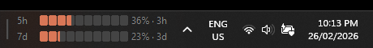

# Code Agent Usage Monitor

`Code Agent Usage Monitor` is a lightweight Windows taskbar widget for tracking local Claude and Codex rate-limit usage in real time.

This repository is a respectful fork of Code Zeno Pty Ltd's `Claude Code Usage Monitor`, extended for multi-agent monitoring and published with upstream attribution intact.

It embeds into the taskbar, stays out of the way, and shows rolling-window utilization plus reset countdowns for both agents.


[](https://opensource.org/licenses/MIT)



## Features

- Four compact taskbar progress bars
- `Cl 5h` and `Cl 7d` for Claude session and weekly usage
- `Cx 5h` and `Cx 7d` for Codex session and weekly usage
- Live countdown text beside each bar
- Embedded Win32 taskbar rendering with dark/light mode support
- Drag-to-reposition behavior inside the taskbar
- Configurable polling interval from the context menu
- Automatic settings persistence in `%APPDATA%\CodeAgentUsageMonitor\settings.json`

## Data sources

### Claude

Claude usage is fetched from local Claude OAuth credentials:

1. Read `~/.claude/.credentials.json` on Windows, or the same file inside accessible WSL distros
2. Refresh an expired token by invoking the local Claude CLI
3. Query Anthropic's OAuth usage endpoint for 5-hour and 7-day utilization
4. Fall back to rate-limit headers from the Messages API if the usage endpoint is unavailable

### Codex

Codex usage is read locally from saved Codex session history:

1. Scan `~/.codex/sessions/**/*.jsonl`
2. Find the most recent `token_count` event with Codex rate-limit snapshots
3. Render the primary 5-hour and secondary 7-day windows in the taskbar widget

This avoids an extra private API integration and stays aligned with the data already emitted by the installed Codex CLI.

## Requirements

- Windows 10 or Windows 11
- Rust toolchain with the MSVC target
- A Claude Pro or Team account authenticated through Claude Code if you want Claude bars populated
- A local Codex CLI login if you want Codex bars populated

Notes:

- If you use Claude Code inside WSL2, keep `claude` installed and authenticated in that distro.
- Codex bars depend on recent local Codex session history being present under `~/.codex/sessions`.

## Build

```bash
cargo build --release
```

The release binary is:

```text
target/release/code-agent-usage-monitor.exe
```

## Run

Launch the executable and it will attach to the Windows taskbar.

- Drag the left divider to reposition it
- Right-click for `Refresh`, `Update Frequency`, `Settings`, and `Exit`

## Project layout

```text
src/
|- main.rs            # entry point
|- models.rs          # shared usage data structures
|- poller.rs          # Claude polling, Codex session parsing, countdown formatting
|- window.rs          # Win32 window, painting, layout, message loop
|- native_interop.rs  # Win32 helpers
\- theme.rs           # Windows dark/light mode detection
```

## Credit

This project is derived from the original `Claude Code Usage Monitor` by Code Zeno Pty Ltd.

Original upstream repository:

- https://github.com/CodeZeno/Claude-Code-Usage-Monitor

This fork extends that work to support multiple code-agent sources, including local Codex rate-limit monitoring, while keeping the same lightweight taskbar-widget approach.

## License

MIT. See [LICENSE](LICENSE).
